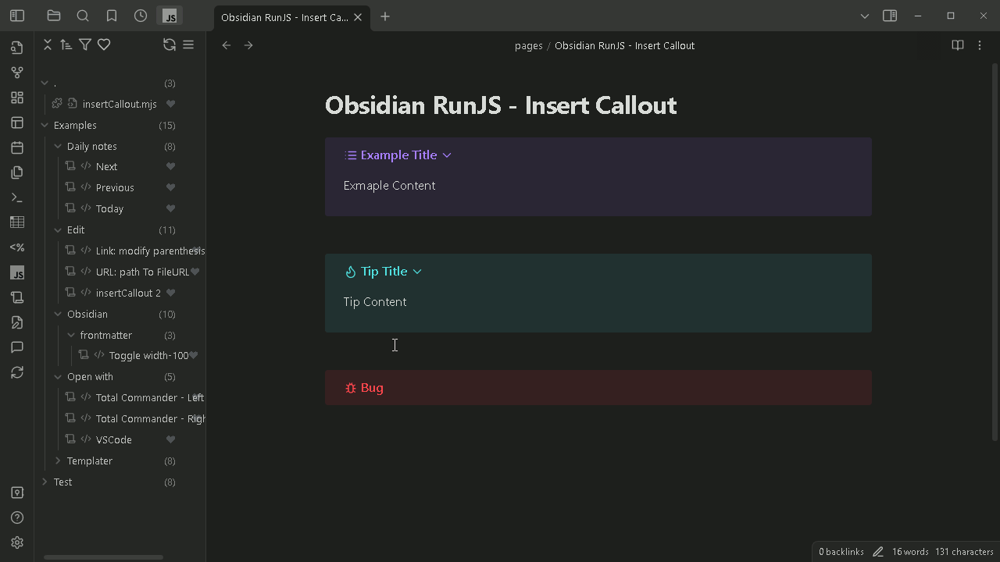
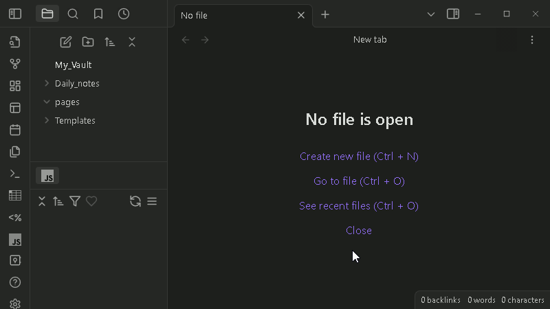
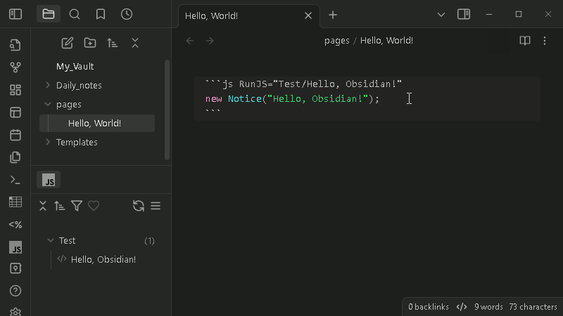
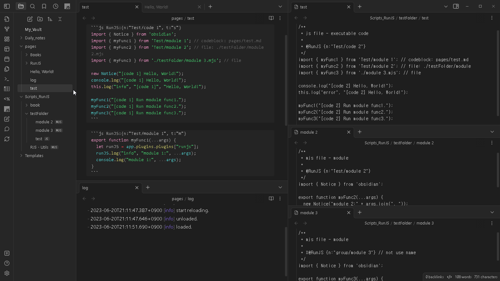
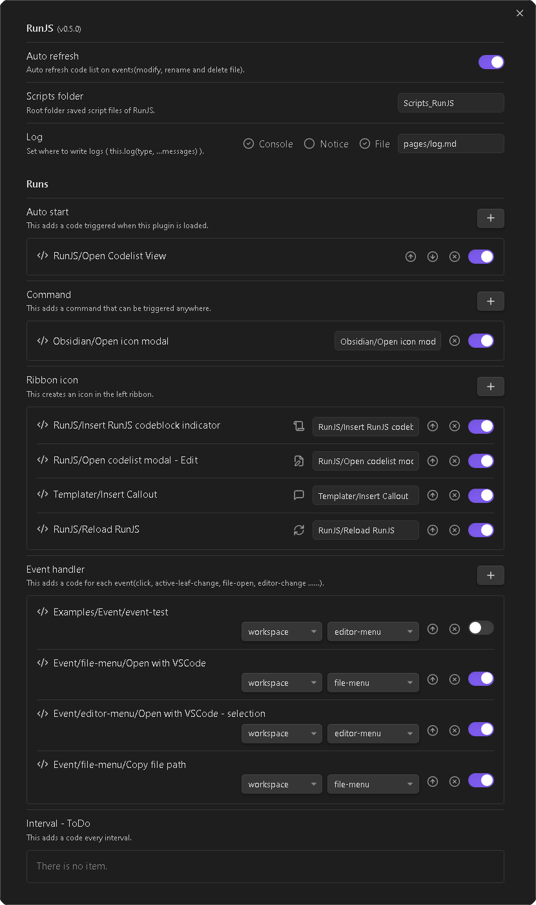

# 옵시디언 - RunJS

*Obsidian에서 쉽고 간단하게 자바스크립트를 실행합니다.*

RunJS는 [옵시디언](https://obsidian.md/)에서 JavaScript 코드를 실행하기 위한 플러그인입니다. 별도의 플러그인을 생성할 필요 없이 사소한(?) 코드들을 바로 실행할 수 있습니다. 그러나 다른 플러그인과 마찬가지로 Obsidian 및 노트들을 다루는 코드를 실행할 수 있습니다. 실행 코드는 옵시디언 노트들의 코드블록(.md) 또는 별도의 파일(.js, .mjs)로 작성됩니다. 또한 코드를 실행 가능한 코드와 모듈로 나누어 코드 관리를 할 수 있도록 합니다.


이 예에서는 [Insert Callout](https://github.com/eoureo/obsidian-runjs/discussions/17)과 [width-100](https://github.com/eoureo/obsidian-runjs/discussions/10) 명령을 실행하고 있습니다. Open code file 메뉴로 소스 코드를 볼 수 있고 수정할 수도 있습니다.


## 특징

- **실행**: 코드를 실행하는 방법에는 여러 가지가 있습니다.
  - **코드 목록 보기**: 모든 코드 목록을 볼 수 있습니다. 그런 다음 한 번의 클릭으로 코드를 실행하거나 보이게 합니다.
  - **실행 코드 대화상자**: 코드를 그룹으로 묶어 계층 구조로 보여 주며 코드를 선택하여 실행합니다.
  - **자동 시작**: RunJS가 로드될때 자동으로 코드를 실행합니다.
  - **명령  추가**: 실행할 명령을 명령 팔레트에 추가합니다. 그러면 단축키를 설정할 수도 있습니다.
  - **리본 아이콘 추가**: 코드를 바로 실행할 수 있도록 리본에 아이콘을 추가합니다.

- **코드 종류**: 자바스크립트 모듈 시스템이 가능합니다.
  - **스크립트**:
    - 노트의 코드블럭 안에 t:"s"(기본값)로 설정된 코드
    - .js 파일 (RunJS 스크립트 폴더 안에 위치)
  - **모듈**:
    - 노트의 코드블럭 안에 t:"m"로 설정된 코드
    - .mjs 파일 (RunJS 스크립트 폴더 안에 위치)

- **코드 작성**: 다른 플러그인을 개발할 때 코드를 수정없이 바로 사용할 수 있습니다.


## 시작 - Hello, World!

JavaScript 코드블럭(js, javascript)에 다음과 같은 지시자 형식을 갖추어야 RunJS에서 코드로 인식 합니다.

- RunJS:"이름"
- RunJS:"그룹/이름"
- RunJS:{n:"이름"}
- RunJS:{n:"그룹/이름",t:"s"}

.js 파일(실행)이나 .mjs 파일(모듈)로 된 코드라면 지시자 없이 RunJS 스크립트 폴더에 넣기만 해도 됩니다.

````markdown
```js RunJS:"Test/Hello, World!"
new Notice("Hello, World!");
```
또는
```js RunJS:{n:"Test/Hello, World!",t:"s"}
new Notice("Hello, World!");
```
````



아래 링크에서 더 볼 수 있습니다.

Hello, World! : Discussions - Codes  
[https://github.com/eoureo/obsidian-runjs/discussions/2](https://github.com/eoureo/obsidian-runjs/discussions/2)


## 코드를 얻는 방법

다음 링크에서 codeblock에 있는 코드는 노트 파일에 그 codeblock 자체를 붙여넣기 하면 됩니다. 코드가 .js 파일이나 .mjs 파일로 된 것이라면  RunJS 스크립트 폴더로 설정한 폴더에 그 파일을 넣어 주면 됩니다.

일부 코드들은 자신 환경에 맞게 코드를 수정해야 할 수도 있습니다. 바꿀 필요가 있는 설정은 일반적으로 코드 맨 위에 있습니다.

- **Codes of RunJS**: [Discussions - Codes](https://github.com/eoureo/obsidian-runjs/discussions)에서 쓸모있는 코드들을 볼 수 있습니다. 여기에 계속 코드들을 올리도록 하겠습니다.
  - [Open with - VSCode, Total Commander](https://github.com/eoureo/obsidian-runjs/discussions/8)
  - [Mange Frontmatter](https://github.com/eoureo/obsidian-runjs/discussions/10): width-100, modified date
  - [Use internal plugin - Daily notes](https://github.com/eoureo/obsidian-runjs/discussions/13): today, previous, next
  - [Use plugin - Templater](https://github.com/eoureo/obsidian-runjs/discussions/19): tp, append_template_to_active_file
  - [Edit note](https://github.com/eoureo/obsidian-runjs/discussions/12): Path to File url, JS Comment
  - [Module - RunJS-Utils.mjs](https://github.com/eoureo/obsidian-runjs/discussions/9): getSelection(), setSelection(text)
  - [Insert Callout (Module for inserting callouts in various ways and Codes)](https://github.com/eoureo/obsidian-runjs/discussions/17)
  - [Event handler - file-menu, editor-menu](https://github.com/eoureo/obsidian-runjs/discussions/24)
- **Codes Share**: [Discussions - Codes Share](https://github.com/eoureo/obsidian-runjs/discussions/categories/codes-share)에  당신이 만든 코드를 공유하고 소개하여 주세요.


**⚠️ 주의 사항**:  
*코드들은 다른 플러그인들과 동일한 작업을 수행할 수 있습니다. 따라서 잘못된 코드는 옵시디언이나 노트들을 망가뜨릴 수 있습니다. 코드를 실행하기 전에 안전한 코드인지 확인해야 합니다.*


## 쓸모있는 코드들

```js
// Using obsidian
import * as obsidian from 'obsidian';

// this plugin
const runJS = app.plugins.plugins["runjs"];

// Using other plugins
const dailyNotes = app.internalPlugins.plugins["daily-notes"];
const dataviewAPI = app.plugins.plugins["dataview"].api;
const templater = app.plugins.plugins["templater-obsidian"].templater;

// Using other module
const url = require('url');
```


## 코드 만들때 도움이 되는 참고사이트

- Home - Developer Documentation  
  https://docs.obsidian.md/Home
- obsidianmd/obsidian-api: Type definitions for the latest Obsidian API.  
  https://github.com/obsidianmd/obsidian-api
- Obsidian Plugin Developer Docs | Obsidian Plugin Developer Docs  
  https://marcus.se.net/obsidian-plugin-docs/


## 사용 예

### 옵시디언 아이콘 대화상자

위의 예("Hello, World!" )에 이어서 다른 코드 블록에 다음과 같은 코드를 작성합니다. 그다음 코드목록을 새로고침 하면 새 코드가 보입니다. 그다음 클릭하여 실행합니다.

````markdown
```js RunJS:{n:"Obsidian/Open icon modal",t:"s"}
// const runJS = app.plugins.plugins["runjs"];
const runJS = this;
runJS.openIconModal();
```
````



아래 링크에서 더 보실 수 있습니다.

Open icon modal : Discussions - Codes  
[https://github.com/eoureo/obsidian-runjs/discussions/3](https://github.com/eoureo/obsidian-runjs/discussions/3)


### 스크립트와 모듈

다음에서는 스크립트와 모듈로 코드를 만들어 사용하는 예를 보여 줍니다.
"code 1"과 "code 2"라는 스크립트 항목이 코드목록에 보여집니다. 이 스크립트들에서는 자체 실행 코드 외에도 "module 1"과 "module 2", "module 3"에 있는 함수를 사용하고 있습니다.
그 실행 결과는 log 파일(플러그인 설정에서 설정한 파일)에 적어집니다.

test.md - 스크립트들과 모듈들은 하나의 파일에 같이 또는 여러 파일에 나누어 코드블록 안에 넣을 수 있습니다.

````markdown

```js RunJS:{n:"Test/code 1", t:"s"}
import { Notice } from 'obsidian';
import { myFunc1 } from 'Test/module 1'; // codeblock: pages/test.md
import { myFunc2 } from 'Test/module 2'; // file: ./testFolder/module 2.mjs
import { myFunc3 } from './testFolder/module 3.mjs'; // file

new Notice("[code 1] Hello, World!");
console.log("[code 1] Hello, World!");
this.log("info", "[code 1]", "Hello, World!");

myFunc1(this.app, "[code 1] Run module func1.");
myFunc2("[code 1] Run module func2.");
myFunc3("[code 1] Run module func3.");
```

```js RunJS:{n:"Test/module 1", t:"m"}
export function myFunc1(app, ...args) {
  let runJS = app.plugins.plugins["runjs"];
  runJS.log("info", "module 1:", ...args);
  console.log("module 1:", ...args);
}
```

````


Scripts_RunJS/testFolder/test.js - 스크립트 파일 저장 폴더(플러그인 설정에서 설정)에 저장된 스크립트(.js 파일))

```js
/**
 * js file - script. executable code
 * 
 * @RunJS {n:"Test/code 2"}
 */
import { myFunc1 } from 'Test/module 1'; // codeblock: pages/test.md
import { myFunc2 } from 'Test/module 2'; // file: ./testFolder/module 2.mjs
import { myFunc3 } from './module 3.mjs'; // file: ./testFolder/module 3.mjs

console.log("[code 2] Hello, World!");
this.log("error", "[code 2] Hello, World!");

myFunc1(this.app, "[code 2] Run module func1.");
myFunc2("[code 2] Run module func2.");
myFunc3("[code 2] Run module func3.");
```


Scripts_RunJS/testFolder/module 2.mjs - 모듈 파일(.mjs)

```js
/**
 * mjs file - module
 * 
 * @RunJS {n:"Test/module 2"}
 */
import { Notice } from 'obsidian';

export function myFunc2(...args) {
  new Notice("module 2:" + args.join(", "));
  console.log("module 2:",...args);
}
```


Scripts_RunJS/testFolder/module 3.mjs - 모듈 파일(.mjs)

```js
/**
 * mjs file - module
 * 
 * X@RunJS {n:"group/module 3"} // not use name
 */
import { Notice } from 'obsidian';

export function myFunc3(...args) {
  new Notice("module 3:" + args.join(", "));
  console.log("module 3:",...args);
}
```

아래 이미지는 위의 코드들을 실행하는 모습을 보여 줍니다.




## RunJS 설정

다음은 RunJS 설정 대화상자입니다.




## API

- openCodeListModal(groupRoot?: string)
- openObjectModal(object?: { [key: string]: any }, callback?: (key: string) => void) [https://github.com/eoureo/obsidian-runjs/discussions/7](https://github.com/eoureo/obsidian-runjs/discussions/7)
- openIconModal(callback?: (icon: string) => void) [https://github.com/eoureo/obsidian-runjs/discussions/3](https://github.com/eoureo/obsidian-runjs/discussions/3)
- runCodeByName(name: string)
- dialogs [https://github.com/eoureo/obsidian-runjs/discussions/20](https://github.com/eoureo/obsidian-runjs/discussions/20):
  - alert(message: string)
  - confirm(message: string)
  - prompt(message: string, messagDefault: string = "", placeholder: string = "", multiLine: boolean = false)
  - suggest(message: string, list: string[], placeholder: string = "")


## 기부

이 플러그인이 마음에 들면 지속적인 개발을 지원하기 위해 기부 부탁 드립니다.

<a href="https://www.buymeacoffee.com/eoureo" target="_blank"></a>  
<a href="https://www.buymeacoffee.com/eoureo" target="_blank"></a>  
