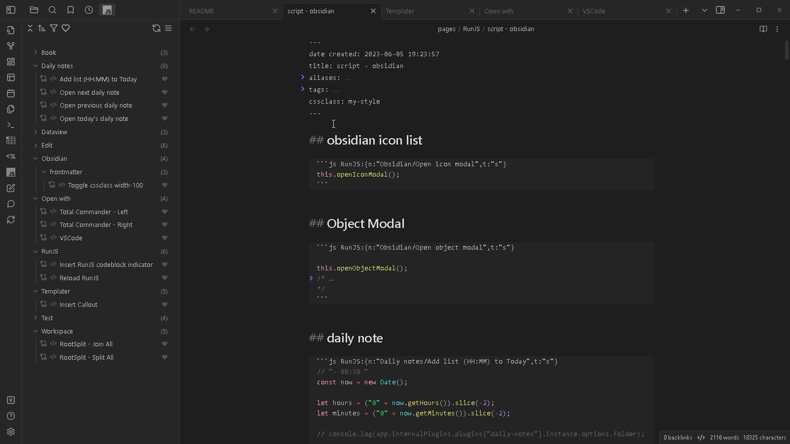
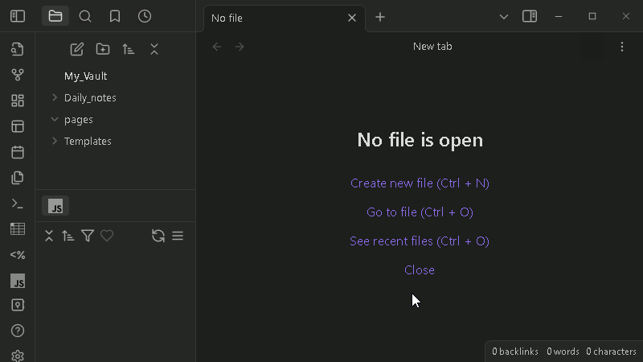
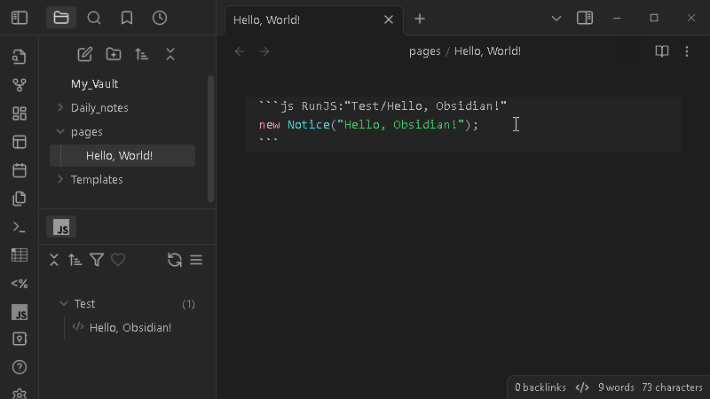
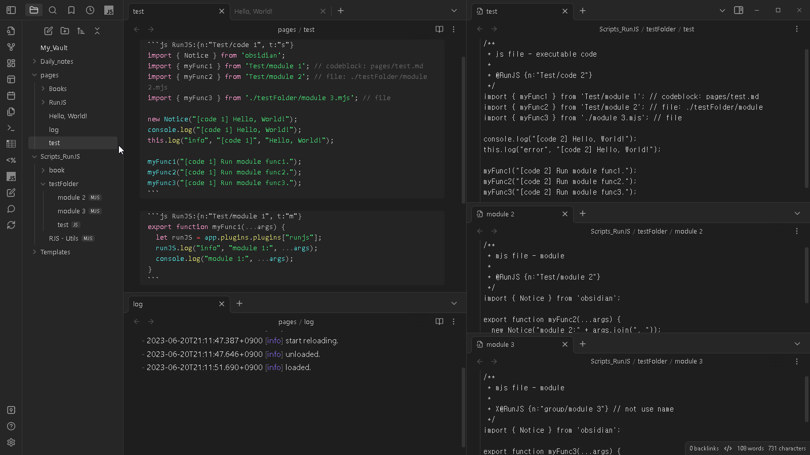
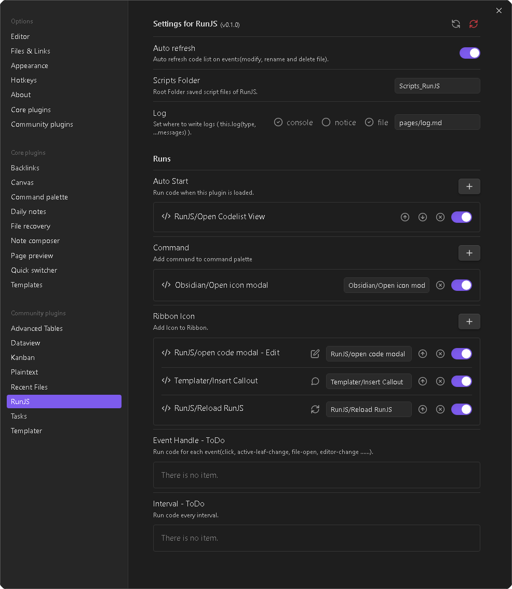

# Obsidian - RunJS

*Let's run JavaScript easily and simply in Obsidian.*

RunJS is a plugin for running JavaScript code in [Obsidian](https://obsidian.md/). You can directly run trivial(?) code snippets without having to create a separate plugin. But, like any other plugin, you can run code that manages Obsidian and notes. Codes is written as codeblocks (.md) in Obsidian Notes or as separate files (.js, .mjs). You also have the option to break down your code into executable code and modules to give you better organization.

<p ><small>This is a simple usage example. Click on a command(Toggle cssclass width-100) in the Codelist View. Then add "width-100" value to cssclass in frontmatter. The style saved in CSS Snippets is applied, making note wider. Clicking on it again removes the "width-100" value and the width of the note returns to its original width. Run "Open code file" command and you can see the code. Then you can modify it.</small></p>

You can see some useful code in [Discussions - Codes](https://github.com/eoureo/obsidian-runjs/discussions). I'll keep posting the codes here. Also, please share and introduce your code to [Discussions - Codes Share](https://github.com/eoureo/obsidian-runjs/discussions/categories/codes-share).

**Caution**:  
*Codes can do the same thing as other plugins. So bad code can potentially disrupt Obsidian or corrupt notes. It is important to ensure that the code is safe before executing it.*


## Features

- **Runs**: There are multiple ways to run code.
  - **Codelist View**: You can view all code lists. Then run code or view code with one click.
  - **Run Code Modal**: Select a code in a hierarchical structure of code groups and then run it.
  - **Autostart**: Run code automatically when RunJS is loaded.
  - **Add command**: Add a command to be executed to command palette. Then you can additionally set a Hotkey on it.
  - **Add Ribbon icon**: Add an icon to Ribbon to run code right away.

- **Code types**: JavaScript module system is available.
  - **script**: code set to t:"s" (default) (in codeblock of note) or .js file (in RunJS Scripts folder)
  - **module**: code set to t:"m" (in codeblock of note) or .mjs file (in RunJS Scripts folder)

- **Coding**: When developing other plugins, the code can be used directly without modification.


## Start - Hello, World!

````markdown
```js RunJS:"Test/Hello, World!"
new Notice("Hello, World!");
```
or
```js RunJS:{n:"Test/Hello, World!",t:"s"}
new Notice("Hello, World!");
```
````



You can see more at the link below.

Hello, World! : Discussions - Codes  
https://github.com/eoureo/obsidian-runjs/discussions/2  


## Useful starter codes

```js
// Using obsidian
import * as obsidian from 'obsidian';

// this plugin
const runJS = this;

// Using other plugins
const dailyNotes = runJS.app.internalPlugins.plugins["daily-notes"];
const dataviewAPI = runJS.app.plugins.plugins["dataview"].api;
const templater = runJS.app.plugins.plugins["templater-obsidian"].templater;

// Using other module
const url = require('url');
```


## References for writing codes

- Home - Developer Documentation  
  https://docs.obsidian.md/Home
- obsidianmd/obsidian-api: Type definitions for the latest Obsidian API.  
  https://github.com/obsidianmd/obsidian-api
- Obsidian Plugin Developer Docs | Obsidian Plugin Developer Docs  
  https://marcus.se.net/obsidian-plugin-docs/


## Examples

### Obsidian Icon list

Continuing from the example above ("Hello, World!"), write the following code in another code block. Then refresh the code list and you will see the new code. Then click it to run.

````markdown
```js RunJS:{n:"Obsidian/Open icon modal",t:"s"}
// const runJS = app.plugins.plugins["runjs"];
const runJS = this;
runJS.openIconModal();
```
````



You can see more at the link below.

Open icon modal  : Discussions - Codes  
https://github.com/eoureo/obsidian-runjs/discussions/3  


### Scripts & Modules

The following shows examples of creating and using code with scripts and modules.
Scripts named "code 1" and "code 2" are shown in the list. In addition to its own executable code, this script uses functions from "module 1", "module 2", and "module 3".
The execution result is written in the log file(the file set in the plugin settings).

test.md - Scripts and modules can be put in a code block, either together in a single file or split into multiple files.

````markdown

```js RunJS:{n:"Test/code 1", t:"s"}
import { Notice } from 'obsidian';
import { myFunc1 } from 'Test/module 1'; // codeblock: pages/test.md
import { myFunc2 } from 'Test/module 2'; // file: ./testFolder/module 2.mjs
import { myFunc3 } from './testFolder/module 3.mjs'; // file

new Notice("[code 1] Hello, World!");
console.log("[code 1] Hello, World!");
this.log("info", "[code 1]", "Hello, World!");

myFunc1(this.app, "[code 1] Run module func1.");
myFunc2("[code 1] Run module func2.");
myFunc3("[code 1] Run module func3.");
```

```js RunJS:{n:"Test/module 1", t:"m"}
export function myFunc1(app, ...args) {
  let runJS = app.plugins.plugins["runjs"];
  runJS.log("info", "module 1:", ...args);
  console.log("module 1:", ...args);
}
```

````


Scripts_RunJS/testFolder/test.js - Script(.js file) saved in the script file storage folder set in the plugin settings

```js
/**
 * js file - script. executable code
 * 
 * @RunJS {n:"Test/code 2"}
 */
import { myFunc1 } from 'Test/module 1'; // codeblock: pages/test.md
import { myFunc2 } from 'Test/module 2'; // file: ./testFolder/module 2.mjs
import { myFunc3 } from './module 3.mjs'; // file: ./testFolder/module 3.mjs

console.log("[code 2] Hello, World!");
this.log("error", "[code 2] Hello, World!");

myFunc1(this.app, "[code 2] Run module func1.");
myFunc2("[code 2] Run module func2.");
myFunc3("[code 2] Run module func3.");
```


Scripts_RunJS/testFolder/module 2.mjs - module file

```js
/**
 * mjs file - module
 * 
 * @RunJS {n:"Test/module 2"}
 */
import { Notice } from 'obsidian';

export function myFunc2(...args) {
  new Notice("module 2:" + args.join(", "));
  console.log("module 2:",...args);
}
```


Scripts_RunJS/testFolder/module 3.mjs - module file

```js
/**
 * mjs file - module
 * 
 * X@RunJS {n:"group/module 3"} // not use name
 */
import { Notice } from 'obsidian';

export function myFunc3(...args) {
  new Notice("module 3:" + args.join(", "));
  console.log("module 3:",...args);
}
```

You can see the above codes running in the image below.




## Settingtab

Here is the RunJS settings dialog.



## Donate

If you like this plugin, consider donating to support continued development.

<a href="https://www.buymeacoffee.com/eoureo" target="_blank"></a>  
<a href="https://www.buymeacoffee.com/eoureo" target="_blank"></a>  
